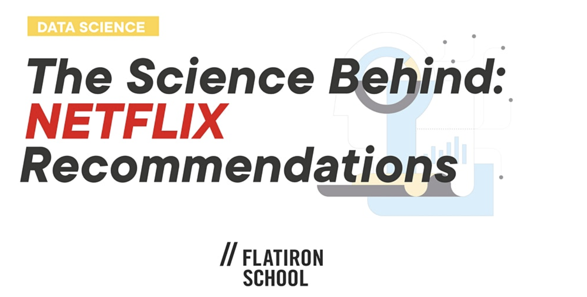

# The Science of Netflix

A code along workshop for the Flatiron School Meetup [The Science Behind Netflix Recommendations : Talk | Chicago](https://hi.flatironschool.com/GTW-2020-22-04-TheScienceBehindNetflixRecommendations_rsvp).
The [original materials for this workshop](https://github.com/yishuen/meetup-movie-recommender) were developed by Flatiron NYC Coach [Yish Lim](https://www.linkedin.com/in/yishuen-lim/) and were updated and adapted for online Zoom broadcast by [David John Baker](https://github.com/davidjohnbaker1/science-of-netflix) and [Ben Oren](https://github.com/Ben-Oren/science-of-netflix).

This version of the workshop was presented on:

* April 22nd, 2020 
* May 16th, 2020
* May 26th, 2020
* September 24th, 2020

The slides from the presentation are available [here](https://github.com/Ben-Oren/science-of-netflix/blob/master/presentation.pdf) and the collaborative document in use during the broadcast is [here](https://docs.google.com/document/d/1ZvcSvzV8Cu4YbwdqdVc6F_6bI4B2QM1hbnwioEdppew).  There will be a link here to the video recording made of the talk as well. 

[Here is a binder](https://mybinder.org/v2/gh/yishuen/meetup-movie-recommender/master) you can launch the notebook from. 

The dataset used is **The Movies Dataset** found on Kaggle, specifically from the file `ratings small.csv`: https://www.kaggle.com/rounakbanik/the-movies-dataset

If you do want to run the code on your own, download Jupyter Notebook and run these lines in your terminal:

 1. `git clone https://github.com/ben-oren/science-of-netflix.git`
 2. `cd science-of-netflix`
 3. `jupyter notebook`

## Additional Readings and Resources:

Yish has written a couple posts on Medium about recommendation engines on her [blog](https://medium.com/@yishuen):
- [A Primer to Recommendation Engines](https://towardsdatascience.com/a-primer-to-recommendation-engines-49bd12ed849f)
- [Collaborative Filtering on Utility Matrices](https://towardsdatascience.com/math-for-data-science-collaborative-filtering-on-utility-matrices-e62fa9badaab)

There are several freely available textbooks which mention recommendation systems.  The first link is a good general introduction; the second one goes into a deeper dive of the math underlying SVD using gradient descent + alternating least squares as demonstrated in the talk. 
- https://link.springer.com/book/10.1007%2F978-3-319-29659-3
- http://infolab.stanford.edu/~ullman/mmds/book.pdf

Here are some other links to podcast episodes on recommendation engines:
- Data Skeptic: http://dataskeptic.libsyn.com/recommender-systems-live-from-farcon-2017
- Linear Digressions: http://lineardigressions.com/episodes/2017/6/25/factorization-machines

Feel free to reach out to [Yish](https://www.linkedin.com/in/yishuen-lim/), [Dave](https://www.linkedin.com/in/david-john-baker-phd/) or [Ben](https://www.linkedin.com/in/oren-ben-k)!

